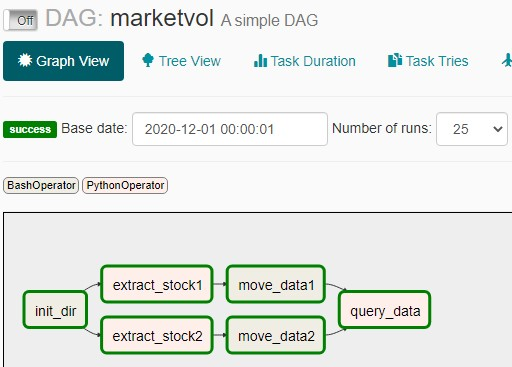
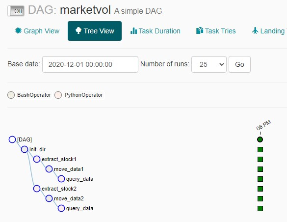

# sb-miniproject7
Airflow DAG scheduling to get stock data from Yahoo! Finance, save to csv files, fetch csv file to database and query.

## What the project does
* Download the daily price data for stock symbols `AAPL` and `TSLA`. 
* The workflow should be scheduled to run at 6 PM on every weekday (Mon-Fri)
* Save the datasets into CSV file and load them into HDFS
* Run customer query on the downloaded datasets

## Prerequisites
* Airflow is installed
* package yfinance installed (`pip install yfinance`)
* pandas (`pip install pandas`)

## Setup
```
$ docker-compose build && docker-compose up
```

## Implementation
* Use `docker-compose` to wrap airflow settings inside one container
* For simplicity, we implement all tasks and helper function inside one python file `extract.py` inside `dags` folder.

Step | task id(s) | Description
---- | --------|------------
0| `init_dir`| Setup the temperation location for daily data. Using a `BashOperator`
1| `extract_stock1`, `extract_stock2` | Extract stock data from Yahoo! Finance and write data as CSV files on temperation location
2| `move_data1`, `move_data2` | Move CSV files from temperation location to database location
3| `query_data` | Query data in database location

The task dependencies is illustrated as the figure below:




